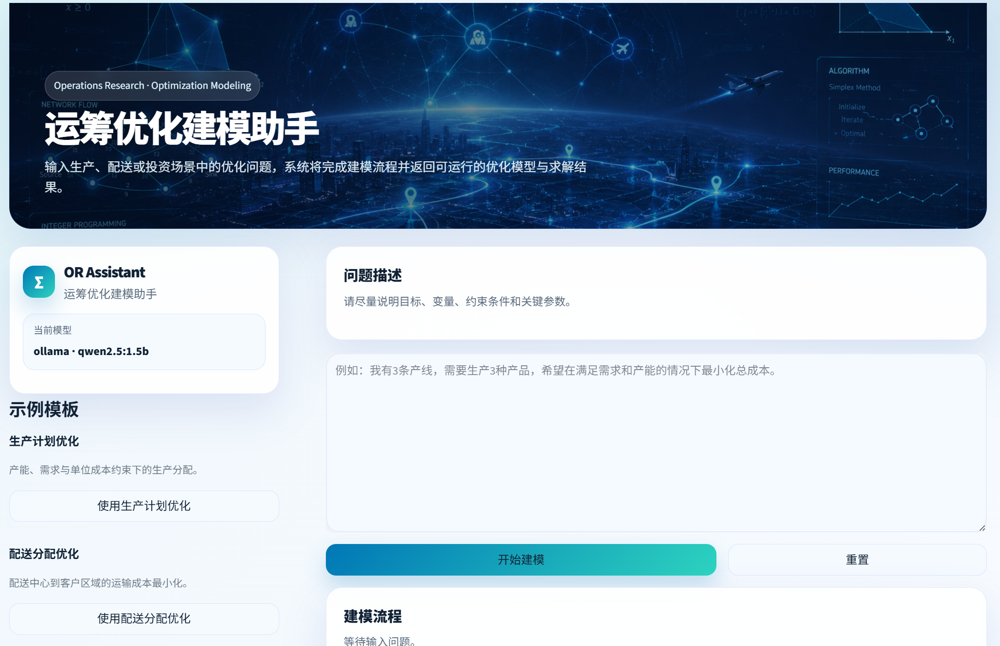
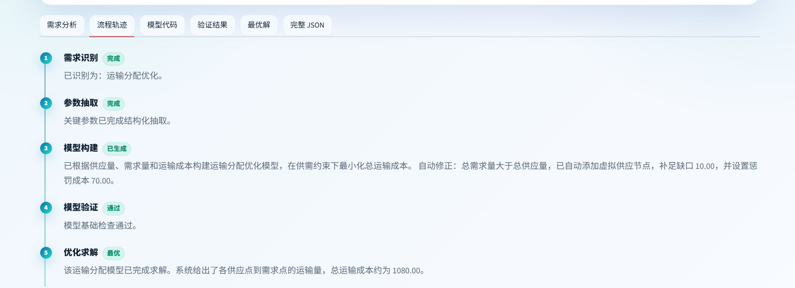

# AI-Powered OR Modeling Assistant

### 面向运筹优化建模的 AI Assistant / Skills-Agent Workflow Demo

---

## 项目简介 | Project Overview

本项目是一个面向运筹优化（Operations Research）的 AI-assisted Modeling Copilot。

系统支持将自然语言中的优化问题自动转换为结构化参数、运筹优化模型与可执行求解流程，并通过 Streamlit UI 返回结果解释与 JSON 中间表示。

This project focuses on:

```text
Natural Language
→ Structured Extraction
→ Optimization Modeling
→ Solver Execution
```

当前版本主要聚焦于：

* 生产计划优化（Production Planning）
* 运输分配优化（Transportation Optimization）
* 参数结构化抽取（Structured Parameter Extraction）
* 自动模型验证（Model Validation）
* 自动供需修正（Auto Correction）
* Solver Workflow Pipeline

项目整体采用 Skills-Agent Workflow 思路进行模块化设计。

---

# 项目展示 | Demo Preview

## SaaS-style OR Modeling Interface



---

## Workflow-based Optimization Pipeline




## Workflow Pipeline

```text
用户自然语言输入
        ↓
需求识别（Intent Recognition）
        ↓
参数抽取（Structured Extraction）
        ↓
优化模型构建（Modeling）
        ↓
模型验证（Validation）
        ↓
Solver 求解执行
        ↓
结果解释与 JSON 输出
```

---

## UI Features

当前版本包含：

* SaaS-style Streamlit UI
* Workflow Timeline
* JSON Intermediate Representation
* Solver Result Cards
* Structured Validation Result
* Auto Correction Explanation
* Dark / Light Theme
* Modular Skills Pipeline

---

# 核心功能 | Core Features

## 1. 自然语言优化问题识别

系统支持从自然语言中识别优化问题类型，例如：

```text
“我想降低物流运输成本”
“请给出最优生产方案”
```

并自动分类为：

* Production Planning
* Transportation Optimization
* Portfolio-style Optimization Workflow

---

## 2. Structured JSON 参数抽取

系统会将自然语言中的参数自动转换为结构化 JSON。

示例：

```json
{
  "supply": {
    "Factory_A": 50,
    "Factory_B": 70
  },
  "demand": {
    "Warehouse_X": 30,
    "Warehouse_Y": 40,
    "Warehouse_Z": 60
  }
}
```

当前版本采用：

* Rule-based Parsing
* Lightweight LLM Completion
* Structured Intermediate Representation

进行参数抽取。

---

## 3. 运筹优化模型生成

系统会根据结构化参数自动生成：

* 生产计划线性规划模型
* Transportation LP Model
* Supply-Demand Balance Constraints
* Objective Function
* Decision Variables

当前版本基于：

* PuLP
* CBC Solver

进行优化建模与求解。

---

## 4. 自动模型验证

系统会自动检查：

* 参数缺失
* Supply-Demand Balance
* Basic Feasibility
* Constraint Completeness

并给出结构化验证结果。

---

## 5. 自动修正（Auto Correction）

当前版本支持：

* 自动供需平衡修正
* Dummy Supply Node Generation
* Penalty Cost Injection

例如：

当总需求量大于总供应量时：

系统会自动添加虚拟供应节点（dummy source）以完成求解。

---

# 系统架构 | Architecture

```text
Frontend (Streamlit)
        ↓
Workflow Controller
        ↓
Intent Recognition
        ↓
Parameter Extraction
        ↓
Model Builder
        ↓
Validation Layer
        ↓
Solver Engine
        ↓
Structured Result + JSON
```

---

# 技术栈 | Tech Stack

| 模块           | 技术                           |
| ------------ | ---------------------------- |
| Frontend     | Streamlit                    |
| Backend      | FastAPI                      |
| Optimization | PuLP / CBC                   |
| Workflow     | Skills-Agent Style Pipeline  |
| Parsing      | Rule-based + Lightweight LLM |
| UI           | SaaS-style Streamlit UI      |
| Language     | Python                       |

---

# 项目特点 | Why This Project Is Different

与传统 Chatbot Demo 不同：

本项目重点关注：

```text
Natural Language
→ Structured Extraction
→ Optimization Modeling
→ Solver Execution
```

而不是：

```text
Chat-only interaction
```

当前系统更加偏向：

* AI Workflow
* Structured Reasoning
* Optimization Copilot
* Skills-Agent Pipeline

---

# 当前限制 | Current Limitations

当前版本主要支持：

* Single-turn Workflow Execution
* Fixed Modeling Templates
* Lightweight Constraint Parsing

以下能力仍在规划中：

* Multi-turn Clarification
* Persistent Conversational Memory
* Complex Integer Programming
* Time Window Constraints
* VRP Route Sequence Constraints
* Visualization Dashboard
* Solver Analytics

---

# Roadmap

未来计划包括：

* Multi-turn Agent Workflow
* Additional OR Modeling Skills
* Facility Location Modeling
* Assignment Optimization
* Scheduling Optimization
* Simplified VRP Support
* Result Visualization
* Exportable Reports
* Authentication & Deployment
* LLM-based Structured Parsing

---

# 安全说明 | Safety Notes

当前版本采用：

```text
Structured JSON → Controlled Modeling Template
```

而不是直接执行 LLM 输出代码。

这样可以避免：

* Arbitrary Code Execution
* Unsafe Prompt-generated Solver Logic
* Uncontrolled Dynamic Code

当前系统更适合：

* Local Deployment
* Workflow Demonstration
* AI Product Prototype
* Optimization Education Demo

---

# 适用方向 | Potential Applications

本项目适用于：

* AI Product Workflow Demo
* Optimization Modeling Assistant
* OR Education Demo
* AI Agent Workflow Research
* Skills-Agent Prototype
* AI Copilot Exploration

---

# 本地运行 | Local Deployment

## 安装依赖

```bash
pip install -r requirements.txt
```

---

## 启动后端

```bash
uvicorn main:app --reload
```

---

## 启动前端

```bash
streamlit run streamlit_app.py
```

---

# 示例输入 | Example Input

## Production Planning

```text
一家工厂生产产品A和产品B。

产品A每件利润30元，
产品B每件利润20元。

产品A需要2小时加工，
产品B需要1小时加工。

工厂总共有100小时可用。

请给出最优生产方案。
```

---

## Transportation Optimization

```text
工厂A供应50件货物，
工厂B供应70件货物。

仓库X需求30件，
仓库Y需求40件，
仓库Z需求60件。

运输成本如下：

A到X成本2
A到Y成本4
A到Z成本5

B到X成本3
B到Y成本1
B到Z成本7

请给出最低运输成本方案。
```

---

# 项目定位 | Positioning

当前版本定位为：

一个可本地部署（local-deployable）的 AI-assisted OR Modeling Copilot。

项目重点展示：

* AI Workflow Design
* Structured Reasoning
* Optimization Modeling Pipeline
* Skills-Agent Architecture
* Solver Integration
* Product-style AI UI

---

# 作者说明 | Notes

This repository is mainly built for:

* AI Product / AI Workflow portfolio demonstration
* Optimization-oriented AI application exploration
* Skills-Agent workflow experiments
* OR + AI integration research

---

# License

MIT License
