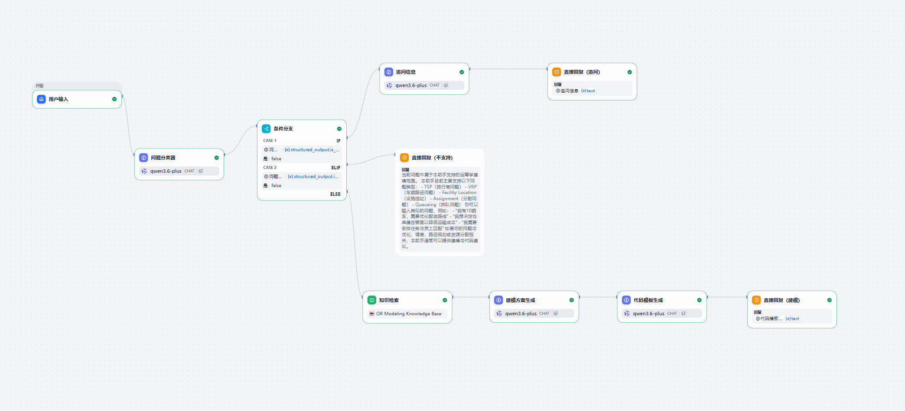

# 技术演进

## 阶段1：Dify框架探索（2026年Q1）

早期使用Dify框架构建运筹优化问题的LLM工作流原型。

### 原型特点
- 可视化工作流设计，快速迭代
- 用qwen3.6模型处理问题识别和参数抽取
- 多路由分类（生产规划、运输优化等）

### 遇到的主要问题
1. **模型验证逻辑难以实现** - 供需平衡检测、约束冲突处理等需要复杂的条件分支，Dify的流程控制显得冗长
2. **缺乏自动修正机制** - 无法实现参数错误时的自动纠正和重新求解
3. **可编程性受限** - 某些优化算法（虚拟供应节点自动生成）无法优雅实现

### 关键认知
这个阶段验证了**自然语言处理运筹优化问题的可行性**，但也清楚地暴露了低代码平台在生产化时的局限。

---

## 阶段2：生产级Python实现（2026年Q2）

基于Dify阶段的学习和教训，决定用Python + FastAPI + Streamlit重新实现，采用**Multi-step Workflow架构**。

### 核心改进

| 指标 | Dify版本 | Python版本 | 提升 |
|-----|--------|---------|------|
| 模型验证覆盖度 | 部分 | 完整 | ✅ |
| 自动修正能力 | 无 | 有 | ✅ |
| 错误定位精度 | 粗糙 | 精确到步骤 | ✅ |

### 架构设计

采用5步骤Workflow：
1. **Intent Recognition** - 意图识别
2. **Structured Extraction** - 参数抽取
3. **Model Builder** - 模型构建
4. **Validation** - 模型验证
5. **Solver** - 求解执行

每步都有明确的输入输出、完整的验证和修正机制。

### 实际验证
在学校进行了真实用户测试，18名学生参与，系统表现稳定可靠。

详见 [性能测试报告](./性能测试报告.md)

---

## 技术决策总结

**为什么最后选择Python而不是继续用Dify？**

1. **教学场景需要可解释性** - 学生要能看到每一步的结果，而不是黑盒输出
2. **生产场景需要可靠性** - 错误恢复要完整，系统要稳定可控
3. **复杂逻辑需要代码能力** - 自动修正算法、供需平衡处理等
4. **整合多个技术栈** - LLM + 优化求解器的协调需要编程